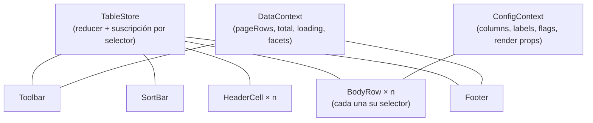

# Composición

`<DataTable>` es un preset. Debajo hay un store con selectores y parts que se
suscriben solas — **sin prop drilling** — y esa API es pública: puedes montar
tu propia tabla pieza a pieza, quitar lo que no quieras y meter lo tuyo.



## Hooks públicos

```tsx
import {
  useTableSelector,   // suscríbete a CUALQUIER porción del estado
  useTableDispatch,   // dispara acciones tipadas
  useTableConfig,     // columnas, labels, flags
  useTableData,       // filas de la página, total, loading, facets, export
  useIsSelected,      // selección de UNA fila (selector optimizado)
  useSortEntry,       // { dir, index, count } de UNA columna
} from '@pyxis-cx/generic-flexible-table'
```

## Ejemplo: toolbar propia

Cualquier componente montado dentro de la tabla puede leer y despachar:

```tsx
function MiBarraDeAcciones() {
  const dispatch = useTableDispatch()
  const seleccionadas = useTableSelector((s) => s.ui.selection.size)
  const filtrosActivos = useTableSelector((s) => s.committed.filters.length)

  return (
    <div className="mi-barra">
      {seleccionadas > 0 && <button onClick={archivar}>Archivar {seleccionadas}</button>}
      {filtrosActivos > 0 && (
        <button onClick={() => dispatch({ type: 'sort/clear' })}>Limpiar orden</button>
      )}
      <input
        placeholder="Buscar…"
        onChange={(e) => dispatch({ type: 'search/set', value: e.target.value })}
      />
    </div>
  )
}
```

## Acciones disponibles

El reducer expone ~25 acciones tipadas (`TableAction`): `sort/toggle`,
`sort/set`, `sort/move`, `sort/clear`, `filter/set`, `search/set`, `page/set`,
`pageSize/set`, `columns/reorder`, `columns/move`, `columns/pin`,
`columns/toggle`, `columns/resize`, `density/set`, `selection/*`,
`expanded/toggle`… Todas **serializables**: puedes loguearlas, reproducirlas o
implementar undo.

```tsx
const dispatch = useTableDispatch()
dispatch({ type: 'sort/set', id: 'salary', dir: 'desc', keepOthers: true })
dispatch({ type: 'columns/pin', id: 'name', side: 'left' })
```

## Modo controlado: el estado vive donde tú digas

`TableState` es serializable. Pásalo por `state` y guárdalo donde quieras —
URL, Zustand, Redux, un `useState` — la tabla lo refleja y emite cada cambio:

```tsx
import { buildTableState, type TableState } from '@pyxis-cx/generic-flexible-table'

function TablaConEstadoEnURL() {
  const [params, setParams] = useSearchParams()
  const state = useMemo<TableState>(
    () => (params.get('t') ? JSON.parse(params.get('t')!) : buildTableState(columns)),
    [params],
  )
  return (
    <DataTable
      columns={columns}
      rows={rows}
      getRowId={getRowId}
      state={state}
      onStateChange={(next) => setParams({ t: JSON.stringify(next) }, { replace: true })}
    />
  )
}
```

Cambiar el estado **desde fuera** (un preset guardado, un botón externo) mueve
la tabla; las interacciones del usuario fluyen hacia fuera por `onStateChange`.
En modo controlado la persistencia en `localStorage` se desactiva — es tuya.

## Persistencia inyectable

Por defecto el estado va a `localStorage`. Implementa `PersistenceAdapter`
para llevarlo a IndexedDB o a tu backend (vistas por usuario):

```tsx
import type { PersistenceAdapter } from '@pyxis-cx/generic-flexible-table'

const serverViews: PersistenceAdapter = {
  read: async (key, version) => {
    const res = await fetch(`/api/views/${key}?v=${version}`)
    return res.ok ? res.json() : null
  },
  write: (key, version, state) =>
    void fetch(`/api/views/${key}?v=${version}`, { method: 'PUT', body: JSON.stringify(state) }),
  clear: (key) => void fetch(`/api/views/${key}`, { method: 'DELETE' }),
}

<DataTable tableId="pedidos" persistence={serverViews} … />
```

`read` puede ser síncrono o `Promise`: con un adapter asíncrono la tabla
arranca con el estado por defecto y aplica el guardado al resolver — y **las
escrituras quedan bloqueadas hasta entonces** para no pisar lo guardado.

## Navegación de teclado

El cuerpo es un ARIA grid con roving tabindex (un solo tabstop): `Tab` entra,
`← → ↑ ↓` mueven la celda activa (conscientes de `dir`), `Home`/`End` primera y
última de la fila, `Ctrl/⌘ + Home/End` extremos del cuerpo, `Enter`/`Espacio`
accionan el control de la celda (checkbox, expansor, botón). Todo por
delegación DOM: navegar no re-renderiza nada.

## Reglas del contrato

1. Los hooks solo funcionan **dentro** del árbol de la tabla (los contextos los
   provee `<DataTable>`).
2. Un selector **no debe cerrar sobre datos de fuera del store** (el caché por
   snapshot devolvería valores rancios). Suscríbete a la referencia
   (`s.ui.selection`) y deriva en render.
3. Los selectores devuelven valores comparados con `Object.is` (o tu `isEqual`
   como segundo argumento) — devuelve primitivas o referencias estables.
