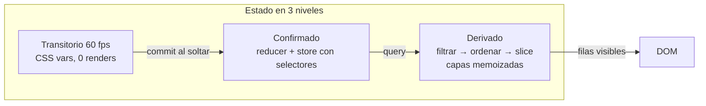

# @list-dragable/datatable

Tabla React **100 % configurable** y **rápida por diseño**. ESM puro, compatible
con Next.js App Router (RSC), estilizada con CSS Modules + design tokens, y con
un contrato de overrides pensado para que nunca escribas `!important`.

## Qué trae

- **Orden múltiple acumulativo y numerado** — cada clic añade la columna al
  `ORDER BY`; el badge es la posición real. Barra de chips reordenable.
- **Filtro por columna** — texto, número, rango, fecha, select múltiple con
  facetas, booleano, o tu propio control.
- **Columnas** — reordenar con drag & drop, redimensionar, fijar a izquierda o
  derecha, ocultar/mostrar, título + subtítulo.
- **Datos** — un solo adapter con dos modos: array en memoria o backend
  paginado. **Nunca** trae todos los datos: hasta el export recorre lotes.
- **Virtualización** de filas, selección, filas expandibles, densidad,
  persistencia de estado en `localStorage`, export CSV/PDF.
- **Rendimiento medido**: cambiar de página con 200 000 filas en memoria cuesta
  ~0 ms; marcar un checkbox re-renderiza **una** fila.

## Arquitectura en 10 segundos

Cada componente se suscribe a **su porción** del estado por selector: la
toolbar no se entera de la selección de filas, una fila no se entera del resize
de una columna, y el resize ni siquiera pasa por React.

## Los tres entries

| Import | Contenido | `"use client"` |
|---|---|---|
| `@list-dragable/datatable` | Componente, parts componibles, hooks del store | Sí |
| `@list-dragable/datatable/server` | Adapters de datos, motor puro, helpers REST | No — usable en RSC y Node |
| `@list-dragable/datatable/export` | CSV/PDF (jspdf es peer **opcional**, carga diferida) | No |

Empieza por [Quickstart](/quickstart).
