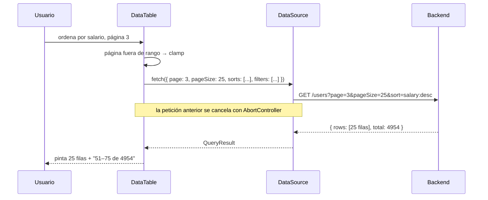
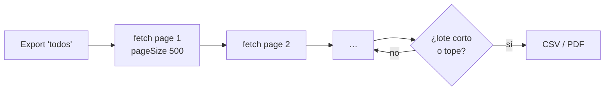

# Modelo de datos

La tabla no sabe de dónde vienen los datos. Emite un `QueryState` y espera un
`QueryResult`. Punto. Ese contrato único cubre memoria, REST, GraphQL o lo que
tengas.

```ts
interface QueryState {
  page: number
  pageSize: number
  sorts: { id: string; dir: 'asc' | 'desc' }[] // orden de aplicación preservado
  filters: { id: string; operator: FilterOperator; value: unknown }[]
  globalSearch: string
}

interface QueryResult<T> {
  rows: T[]   // SOLO la página pedida
  total: number
}
```



## Modo client

Pasa `rows` y no hay fetch: filtro, orden y paginación se resuelven en memoria
con un pipeline en capas memoizadas (cambiar de página es un `slice`, ~0 ms
incluso con 200 000 filas).

```tsx
<DataTable rows={data} columns={columns} getRowId={(r) => r.id} />
```

## Modo server

Pasa `dataSource`. El array `sorts` conserva el orden en que el usuario aplicó
cada criterio: se traduce **posicionalmente** a tu `ORDER BY`.

```ts
import { createServerDataSource, serializeSorts } from '@pyxis-cx/generic-flexible-table/server'

const source = createServerDataSource<Order>({
  fetch: async (q, signal) => {
    // serializeSorts(q) → "department:asc,salary:desc"
    const res = await fetch(`/api/orders?${queryToSearchParams(q)}`, { signal })
    return res.json()
  },
  // opciones de los filtros select que el cliente no puede derivar
  facets: { status: [{ value: 'paid', label: 'Pagado' }] },
})
```

Estados de carga, error con reintento y cancelación de peticiones obsoletas
vienen incluidos.

## Jamás traer todo: export por lotes

El export "todos los resultados" **no** hace un fetch gigante. `fetchAllPaginated`
recorre lotes (500 por defecto) con tope de seguridad (50 000):



```ts
import { fetchAllPaginated } from '@pyxis-cx/generic-flexible-table/server'

const all = await fetchAllPaginated(source, { sorts, filters, globalSearch }, {
  chunkSize: 500,
  maxRows: 50_000,
})
```

## Identidades estables

`dataSource` y `rows` deben ser estables (`useMemo`). Para forzar un refetch
sin cambiar la identidad, cambia `dataSourceKey`:

```tsx
<DataTable dataSource={source} dataSourceKey={refreshCounter} … />
```
