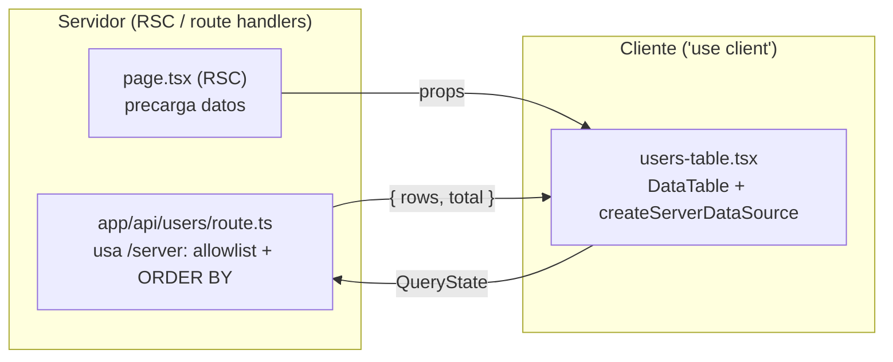

# Next.js (App Router)

Dónde va cada pieza en el árbol RSC, adapter contra tus route handlers,
estado en la URL, theming y gotchas reales. La instalación desde GitHub
Packages está en [Quickstart](/quickstart).



## El mapa RSC: qué entry va en cada lado

| Entry | `"use client"` | Úsalo en |
|---|---|---|
| `@pyxis-cx/generic-flexible-table` | Sí (por fichero) | Client Components |
| `@pyxis-cx/generic-flexible-table/server` | **No** | Route handlers, Server Components, Server Actions — y también en cliente |
| `@pyxis-cx/generic-flexible-table/export` | No | Cliente (usa `document` al descargar) |
| `…/styles.css` | — | `app/layout.tsx`, una vez |

No necesitas envolver nada en `"use client"` por la biblioteca: cada módulo
del entry principal ya lleva su directiva (build con `preserveModules`).

## Setup mínimo

```tsx
// app/layout.tsx
import '@pyxis-cx/generic-flexible-table/styles.css'

export default function RootLayout({ children }: { children: React.ReactNode }) {
  return (
    <html lang="es" suppressHydrationWarning>
      <body>{children}</body>
    </html>
  )
}
```

```tsx
// app/usuarios/columns.ts — módulo compartido, identidad ESTABLE
import type { ColumnDef } from '@pyxis-cx/generic-flexible-table'
import type { User } from '@/lib/types'

export const columns: ColumnDef<User>[] = [
  { id: 'name', header: 'Nombre', accessorKey: 'name', filter: { kind: 'text' } },
  { id: 'email', header: 'Email', accessorKey: 'email', filter: { kind: 'text' } },
  { id: 'age', header: 'Edad', accessorKey: 'age', align: 'right', filter: { kind: 'number' } },
]
```

```tsx
// app/usuarios/users-table.tsx
'use client'
import { useMemo } from 'react'
import { DataTable } from '@pyxis-cx/generic-flexible-table'
import { columns } from './columns'
import type { User } from '@/lib/types'

export function UsersTable({ rows }: { rows: User[] }) {
  return (
    <DataTable<User>
      tableId="usuarios"
      columns={columns}
      rows={rows}                    // modo client: dataset pequeño precargado en RSC
      getRowId={useMemo(() => (r: User) => r.id, [])}
    />
  )
}
```

```tsx
// app/usuarios/page.tsx — Server Component
import { db } from '@/lib/db'
import { UsersTable } from './users-table'

export default async function Page() {
  const rows = await db.user.findMany({ take: 1000 }) // dataset acotado → modo client
  return <UsersTable rows={rows} />
}
```

## Modo server: la tabla habla con tu route handler

Para datasets grandes, la tabla emite `QueryState` y tu API devuelve
`{ rows, total }` — **solo la página pedida, nunca todo**.

```ts
// app/api/users/route.ts — Route Handler (Node)
import { NextResponse } from 'next/server'
import { db } from '@/lib/db'

const ORDENABLES = new Set(['name', 'email', 'age', 'createdAt']) // allowlist SIEMPRE

export async function GET(req: Request) {
  const url = new URL(req.url)
  const page = Math.max(1, Number(url.searchParams.get('page') ?? 1))
  const pageSize = Math.min(100, Number(url.searchParams.get('pageSize') ?? 25))
  const q = url.searchParams.get('q') ?? ''

  // "name:asc,age:desc" — el ORDEN del string ES la prioridad del multi-orden
  const orderBy = (url.searchParams.get('sort') ?? '')
    .split(',')
    .filter(Boolean)
    .map((s) => s.split(':'))
    .filter(([id]) => ORDENABLES.has(id))
    .map(([id, dir]) => ({ [id]: dir === 'desc' ? 'desc' : 'asc' }))

  const where = q ? { OR: [{ name: { contains: q, mode: 'insensitive' } }] } : {}

  const [rows, total] = await Promise.all([
    db.user.findMany({ where, orderBy, skip: (page - 1) * pageSize, take: pageSize }),
    db.user.count({ where }),
  ])
  return NextResponse.json({ rows, total })
}
```

```tsx
// app/usuarios/users-table.tsx
'use client'
import { useMemo } from 'react'
import { DataTable } from '@pyxis-cx/generic-flexible-table'
import {
  createServerDataSource,
  queryToSearchParams,
} from '@pyxis-cx/generic-flexible-table/server'
import { columns } from './columns'

export function UsersTable() {
  const source = useMemo(
    () =>
      createServerDataSource<User>({
        fetch: async (query, signal) => {
          const res = await fetch(`/api/users?${queryToSearchParams(query)}`, { signal })
          if (!res.ok) throw new Error(`HTTP ${res.status}`)
          return res.json()
        },
        // opciones de filtros `select` que el cliente no puede derivar
        facets: { role: [{ value: 'admin', label: 'Admin' }, { value: 'user', label: 'Usuario' }] },
      }),
    [],
  )
  return <DataTable dataSource={source} columns={columns} getRowId={(r) => r.id} tableId="usuarios" />
}
```

Cancelación incluida: la tabla pasa `AbortSignal` y aborta la petición
anterior en cada interacción. Loading bar y estado de error con reintento,
de serie.

### Backend por cursor (Mongo, Dynamo, APIs keyset)

```ts
import { createCursorDataSource } from '@pyxis-cx/generic-flexible-table/server'

const source = createCursorDataSource<User, string>({
  fetch: async ({ cursor, pageSize, sorts }, signal) => {
    const res = await fetch(`/api/users/keyset?after=${cursor ?? ''}&limit=${pageSize}`, { signal })
    const data = await res.json()
    return { rows: data.items, nextCursor: data.nextToken ?? null } // sin total → se estima
  },
})
```

## Estado de la tabla en la URL (deep links compartibles)

`TableState` es serializable — modo controlado + `useSearchParams`:

```tsx
'use client'
import { useCallback, useMemo } from 'react'
import { usePathname, useRouter, useSearchParams } from 'next/navigation'
import { DataTable, buildTableState, type TableState } from '@pyxis-cx/generic-flexible-table'
import { columns } from './columns'

export function TablaEnURL({ rows }: { rows: User[] }) {
  const params = useSearchParams()
  const router = useRouter()
  const pathname = usePathname()

  const state = useMemo<TableState>(() => {
    const raw = params.get('t')
    return raw ? JSON.parse(raw) : buildTableState(columns)
  }, [params])

  const onStateChange = useCallback(
    (next: TableState) => {
      const sp = new URLSearchParams(params)
      sp.set('t', JSON.stringify(next))
      router.replace(`${pathname}?${sp}`, { scroll: false })
    },
    [params, pathname, router],
  )

  return (
    <DataTable columns={columns} rows={rows} getRowId={(r) => r.id}
      state={state} onStateChange={onStateChange} />
  )
}
```

En modo controlado la persistencia interna se desactiva sola — la URL es la
fuente de verdad. Para vistas por usuario en tu backend, usa
`persistence={miAdapter}` (interfaz `PersistenceAdapter`, `read` puede ser
async) en vez de modo controlado.

## Datasets enormes en cliente: Web Worker

```tsx
'use client'
import { useEffect, useMemo } from 'react'
import { DataTable, createWorkerDataSource } from '@pyxis-cx/generic-flexible-table'

export function TablaMasiva({ rows }: { rows: Registro[] }) {
  // SOLO en cliente (usa Worker/Blob): este componente ya es 'use client'
  const source = useMemo(() => createWorkerDataSource(rows, columns), [rows])
  useEffect(() => () => source.terminate(), [source])
  return <DataTable dataSource={source} columns={columns} getRowId={(r) => r.id}
    enableVirtualization />
}
```

Blob worker autocontenido: cero config de webpack/Turbopack. Restricción:
columnas con `accessorKey` y operadores integrados.


## Server Actions

`QueryState` es serializable → una Server Action **es** el fetch del adapter,
sin route handler ni parseo de params. Y la misma función sirve en el RSC para
SSR de la primera página (llamada directa, sin round-trip).

```
app/empleados/
├── page.tsx        # RSC: await fetchEmpleados({...}) → SSR primera página
├── actions.ts      # 'use server' — la action tipada (allowlist + auth)
├── columns.tsx     # ColumnDef[] a nivel módulo
└── tabla.tsx       # 'use client' — DataTable + createServerDataSource
```

```ts
// actions.ts
'use server'
import type { QueryResult, QueryState } from '@pyxis-cx/generic-flexible-table/server'

const ORDENABLES = new Set(['nombre', 'departamento', 'salario'])

export async function fetchEmpleados(query: QueryState): Promise<QueryResult<Empleado>> {
  const orderBy = query.sorts
    .filter((s) => ORDENABLES.has(s.id))     // allowlist SIEMPRE
    .map((s) => ({ [s.id]: s.dir }))         // orden posicional = prioridad
  // …where a partir de query.filters/globalSearch…
  const [rows, total] = await Promise.all([/* findMany */, /* count */])
  return { rows, total }
}
```

```tsx
// tabla.tsx
'use client'
const source = useMemo(
  () => createServerDataSource<Empleado>({ fetch: (query) => fetchEmpleados(query) }),
  [],
)
<DataTable dataSource={source} columns={columns} getRowId={(r) => r.id} />
```

**Action vs route handler**: la action gana en código y auth (`cookies()`
directo), pero Next **serializa** las actions del mismo cliente (tecleo rápido
= cola) y el `AbortSignal` no viaja (la tabla descarta respuestas obsoletas,
el servidor las computa igual). Dashboards internos → action; alto tráfico o
filtros muy interactivos → route handler. Migrar = cambiar solo la función
`fetch`.

## Tu propio componente sobre la tabla

Patrón recomendado para apps y design systems: UN wrapper que fija los
defaults de tu organización (tema, labels, flags, persistencia) y **conserva
los genéricos** — el resto de la app nunca importa la biblioteca directamente.

```tsx
// components/app-table.tsx
'use client'

import { DataTable } from '@pyxis-cx/generic-flexible-table'
import type {
  DataTableProps,
  PersistenceAdapter,
  ThemeTokens,
} from '@pyxis-cx/generic-flexible-table'

const TEMA: ThemeTokens = { colorAccent: '#0e7490', radius: '10px' }

const DEFAULTS = {
  stripedRows: true,
  enableDensityToggle: false,
  pageSizeOptions: [25, 50, 100],
  persistVersion: 2,               // súbelo al cambiar esquemas de columnas
} satisfies Partial<DataTableProps<unknown>>

// vistas por usuario contra tu API en vez de localStorage
const persistencia: PersistenceAdapter = {
  read: async (key, v) => (await fetch(`/api/vistas/${key}?v=${v}`)).json(),
  write: (key, v, s) =>
    void fetch(`/api/vistas/${key}?v=${v}`, { method: 'PUT', body: JSON.stringify(s) }),
  clear: (key) => void fetch(`/api/vistas/${key}`, { method: 'DELETE' }),
}

/** La tabla de la casa: mismos props que DataTable, con los defaults puestos. */
export function AppTable<T>(props: DataTableProps<T>) {
  return <DataTable<T> {...DEFAULTS} theme={TEMA} persistence={persistencia} {...props} />
}
```

Uso en cualquier página — los props explícitos ganan a los defaults:

```tsx
<AppTable<Empleado>
  tableId="empleados"
  columns={columns}
  dataSource={source}
  getRowId={(r) => r.id}
  enableDensityToggle   // override puntual del default
/>
```

Un nivel más: componente de dominio que también fija columnas y datos —
la página queda en una línea:

```tsx
// app/empleados/tabla-empleados.tsx
'use client'
import { useMemo } from 'react'
import { createServerDataSource } from '@pyxis-cx/generic-flexible-table/server'
import { AppTable } from '@/components/app-table'
import { fetchEmpleados } from './actions'
import { columns } from './columns'

export function TablaEmpleados() {
  const source = useMemo(
    () => createServerDataSource<Empleado>({ fetch: (q) => fetchEmpleados(q) }),
    [],
  )
  return <AppTable<Empleado> tableId="empleados" columns={columns}
    dataSource={source} getRowId={(r) => r.id} />
}
```

Reglas del wrapper:

1. Constantes (`TEMA`, `DEFAULTS`, `persistencia`) **a nivel módulo** —
   identidad estable, las filas no se re-renderizan por el wrapper.
2. `satisfies Partial<DataTableProps<unknown>>` valida los defaults sin
   perder inferencia.
3. Spread del consumidor SIEMPRE al final: cualquier página puede desactivar
   un default.
4. Si además necesitas leer estado desde dentro (toolbar propia), combina con
   los hooks de [Composición](/composicion) — el wrapper no te encierra.

## Dark mode

Automático con `prefers-color-scheme`. Forzado (p.ej. con next-themes):

```tsx
<html data-dt-theme={theme} suppressHydrationWarning>
```

`[data-dt-theme="dark" | "light"]` gana sobre la preferencia del sistema.
Theming de marca: tokens `--dt-*` en tu CSS global, o `theme={{ colorAccent: '#059669' }}`
por instancia. Overrides quirúrgicos contra clases estables `dt-*` (todo el CSS
de la biblioteca vive en `@layer datatable`: tu CSS sin layer gana sin
`!important`).

## Export

```tsx
'use client'
import { exportToCsv, exportToPdf } from '@pyxis-cx/generic-flexible-table/export'
```

El menú integrado ya trae CSV/PDF (página o todo — el "todo" en modo server
recorre **lotes paginados** de 500 con tope de 50 000; jamás un fetch total).
jspdf se descarga por `import()` solo al exportar PDF.

## Gotchas reales

1. **Identidades estables**: `columns`, `getRowId`, `dataSource` y todo render
   prop a nivel módulo o `useMemo`/`useCallback`. Las filas los reciben por
   contexto: identidad nueva en cada render = todas las filas re-renderizan.
2. **Grid/flex del layout**: si montas la tabla dentro de un item de grid o
   flex, ponle `min-width: 0` al item — si no, la tabla ensancha el contenedor
   y el scroller interno nunca scrollea (adiós virtualización y sticky).
3. **Allowlist en el backend**: `sorts[].id` y `filters[].id` vienen del
   cliente. Valida contra una lista de columnas permitidas antes de tocar SQL.
4. **SSR**: la tabla renderiza en servidor sin tocar `window` (persistencia y
   popovers son lazy). No hace falta `dynamic(() => …, { ssr: false })`.
5. **Feature flags**: todo se apaga por props (`enableColumnFilters`,
   `enableExport`, `enablePagination`… 17 flags) y por columna (`sortable`,
   `resizable`, `filter`…). Define presets tipados
   (`Partial<DataTableProps<T>>`) y espárcelos.

## Referencias

- Docs completas: [https://pyxis-cx.github.io/generic-flexible-table/](https://pyxis-cx.github.io/generic-flexible-table/)
- Repo: [https://github.com/Pyxis-CX/generic-flexible-table](https://github.com/Pyxis-CX/generic-flexible-table)
- Playground del repo: [`apps/playground`](https://github.com/Pyxis-CX/generic-flexible-table/tree/main/apps/playground)
