# Orden múltiple

El estado del orden es un **array ordenado** — la posición ES la prioridad:

```ts
sorts: [{ id: 'department', dir: 'asc' }, { id: 'salary', dir: 'desc' }]
//  →   ORDER BY department ASC, salary DESC
```

## Ciclo por columna

```mermaid
stateDiagram-v2
    direction LR
    [*] --> SinOrden
    SinOrden --> Asc: clic (se añade AL FINAL del orden)
    Asc --> Desc: clic (conserva su posición)
    Desc --> SinOrden: clic (sale; el resto renumera)
```



Cambiar de dirección **no** mueve la columna dentro del orden: si Salario es el
criterio nº 2 y pasa de asc a desc, sigue siendo el nº 2.

## Modo `accumulate` (por defecto)

| Acción | Efecto |
|---|---|
| Clic en columna nueva | Se **añade al final**, en asc. Las anteriores se conservan |
| Clic en columna ya ordenada | Cicla asc → desc → fuera |
| **Shift/⌘/Ctrl + clic** | Ordena **solo** por esa columna |
| Menú de columna | Asc / Desc acumulan · "Ordenar solo por esta" · "Quitar del orden" |

Con `multiSortMode="modifier"` se invierte (clic reemplaza, modificador
acumula — el comportamiento clásico de Excel). `enableMultiSort={false}` deja
orden simple.

## Numeración visible

- El **badge** de cada cabecera muestra su posición en el `ORDER BY` (siempre
  que participe, también con un solo criterio).
- La barra **"Orden aplicado"** lista los chips numerados: clic invierte la
  dirección, `‹ ›` cambia la prioridad, `×` saca la columna. Se oculta con
  `showSortSummary={false}`.

## En el servidor

`QueryState.sorts` llega en orden de aplicación. Traducción directa:

```ts
// "department:asc,salary:desc"
const orderBy = query.sorts.map((s) => `${s.id} ${s.dir.toUpperCase()}`).join(', ')
db.query(`SELECT * FROM employees ORDER BY ${allowlist(orderBy)} LIMIT ? OFFSET ?`)
```

> Pasa siempre los ids por una allowlist de columnas ordenables — vienen del
> cliente.

## Comparación en modo client

- **Estable**: los empates conservan el orden original (y el de la capa
  anterior del multi-orden).
- **Orden natural**: `item 2` antes que `item 10` (`Intl.Collator` numérico,
  insensible a acentos).
- **Vacíos siempre al final**, con asc y con desc.
- **Claves precalculadas**: una pasada por columna (transformación de Schwartz,
  `Float64Array` para columnas numéricas) — 50 000 filas × 2 criterios ≈ 45 ms.
- `sortFn` por columna para lógica custom.
