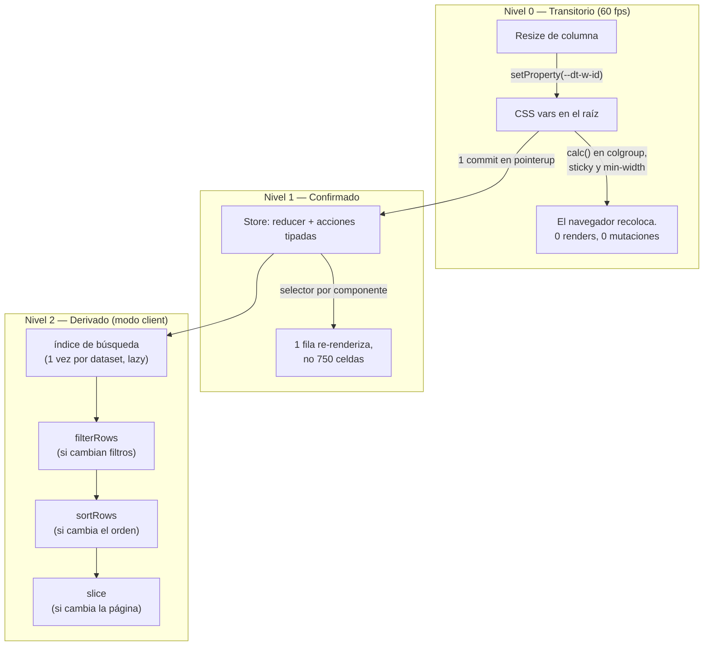

# Performance

La regla que gobierna el diseño: **no meter en React state lo que cambia a
60 fps, no recalcular lo que no cambió, no re-renderizar a quien no le afecta.**

## Estado en tres niveles



- **Nivel 0**: durante el arrastre del resize solo se escribe una CSS var.
  `colgroup`, offsets sticky y `min-width` de la tabla son `calc(var(...))` —
  el navegador rederiva, React ni se entera. Test de CI: 30 `pointermove` = 0
  mutaciones en `tbody`.
- **Nivel 1**: cada fila/celda/cabecera se suscribe por selector
  (`useSyncExternalStore`). Marcar un checkbox toca **una** fila. `dispatch`
  tiene identidad estable y viaja por contexto — no invalida `memo`.
- **Nivel 2**: pipeline en capas memoizadas. Cambiar de página ejecuta SOLO el
  slice; cambiar el orden no re-filtra.

## Números (Node 24, mediana)

| Operación | 50 000 filas | 200 000 filas |
|---|---|---|
| Ordenar (2 criterios) | 45 ms | 198 ms |
| Búsqueda global (índice caliente) | 2,7 ms | 11 ms |
| Filtrar (1 regla) | 26 ms | 91 ms |
| Cambiar de página | ~0 ms | ~0 ms |

El orden usa claves precalculadas (una lectura del accessor por fila, no dos
por comparación; `Float64Array` para columnas numéricas). La búsqueda global
cachea las cadenas normalizadas (`NFD` sin diacríticos) en un índice lazy.

## Lo que te toca a ti

La tabla no puede memoizar por ti lo que le pasas. **Identidades estables**:

```tsx
// ✅ módulo o useMemo/useCallback
const columns = useMemo(() => [...], [])
const getRowId = useCallback((r: Row) => r.id, [])
const renderRowActions = useCallback((row: Row) => <Actions row={row} />, [])

// ❌ inline: cada render del padre re-renderiza TODAS las filas
<DataTable columns={[...]} getRowId={(r) => r.id} renderRowActions={(r) => ...} />
```

## Cuándo activar qué

| Filas visibles por página | Recomendación |
|---|---|
| ≤ 100 | Nada especial |
| 100 – 5 000 | `enableVirtualization` (pinta solo lo visible + overscan) |
| Dataset client > 50 000 | Virtualización + considera pasar a modo server |
| Dataset > 200 000 | Modo server casi siempre; el sort en memoria ya cuesta ~200 ms |

La virtualización mide la altura real de la primera fila del DOM — sobrevive a
cambios de densidad y de tipografía.

## React Compiler

La biblioteca se publica **precompilada** con React Compiler (recomendación
oficial de react.dev para bibliotecas: el compilador de tu app no procesa
`node_modules`). El runtime es `react/compiler-runtime`, incluido en React 19 —
cero dependencias extra. La CI ejecuta la suite de navegador con y sin
compilador, porque la memoización automática puede enmascarar bugs de
dependencias.

## RTL

Pinning, resize, drag & drop y toda la geometría usan propiedades lógicas
(`inset-inline-*`) y signos conscientes de dirección: `dir="rtl"` funciona sin
configuración.

## Benchmarks en CI

`pnpm bench` corre el pipeline sobre 50 000 filas deterministas (PRNG con
semilla). Compara PR contra main con `--outputJson`/`--compare`; para gates
duros usa instrumentación (CodSpeed) — el wall-clock de runners compartidos
tiene ±10 % de ruido.
